# CYBERBLACK-PASSWORDS // HUD EDITION

```
 ██████╗██╗   ██╗██████╗ ███████╗██████╗ ██████╗ ██╗      █████╗  ██████╗██╗  ██╗
██╔════╝╚██╗ ██╔╝██╔══██╗██╔════╝██╔══██╗██╔══██╗██║     ██╔══██╗██╔════╝██║ ██╔╝
██║      ╚████╔╝ ██████╔╝█████╗  ██████╔╝██████╔╝██║     ███████║██║     █████╔╝ 
██║       ╚██╔╝  ██╔══██╗██╔══╝  ██╔══██╗██╔══██╗██║     ██╔══██║██║     ██╔═██╗ 
╚██████╗   ██║   ██████╔╝███████╗██║  ██║██████╔╝███████╗██║  ██║╚██████╗██║  ██╗
 ╚═════╝   ╚═╝   ╚═════╝ ╚══════╝╚═╝  ╚═╝╚═════╝ ╚══════╝╚═╝  ╚═╝ ╚═════╝╚═╝  ╚═╝
                                       CYBERBLACK-PASSWORDS v2.2 
```

**CYBERBLACK-PASSWORDS** is a fully offline, multi-user cybersecurity credential manager, threat incident tracker, file integrity monitor, and forensic analysis platform. Built with a high-contrast monochrome HUD interface featuring **Coolvetica** display typography, **Colorlib Shapely** responsive layout spacing, and hardware-grade authenticated encryption. 

Every byte remains strictly local on your machine: **Zero telemetry, zero cloud synchronization, and zero network calls.**

---

## Quickstart

### 1. Installation

```bash
# Clone the repository
git clone https://github.com/ANONYMOUSworld112/cyber-project-passwords.git
cd cyber-project-passwords

# Install dependencies and package in editable mode
pip install argon2-cffi cryptography platformdirs
pip install -e .
```

### 2. Launching the Platform

```bash
# Start the security terminal daemon (default port: 8899)
python -m csp

# Or specify custom host and port
python -m csp serve --host 127.0.0.1 --port 9000
```

Open `http://127.0.0.1:8899` in your web browser:
1. **First-Run Wizard**: On initial launch, the system displays the root administrator setup wizard.
2. **Authenticated Access**: Once initialized, all subsequent visits require master password authentication via the Auth Gate.

---

## Platform Visual Interface & Screenshots

### 1. System Initialization // First-Run Wizard
On initial deployment, the platform prompts the creation of the root administrator account, generating master encryption profiles, Argon2id KDF salts, and zero-knowledge recovery hint parameters.

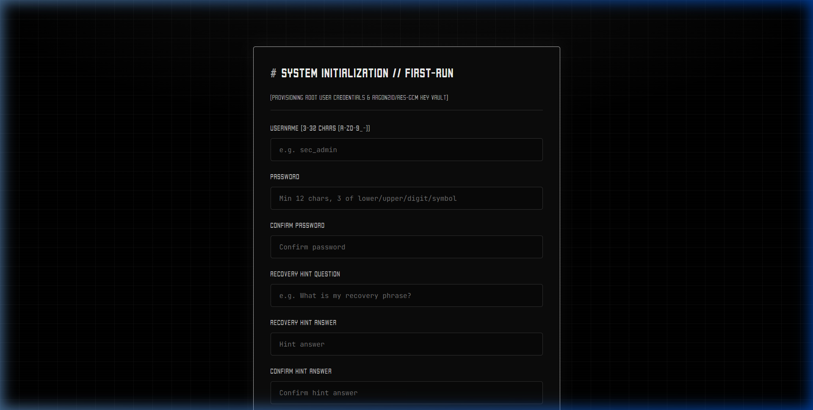

---

### 2. Authentication Gate
The security gate enforces zero-knowledge authentication with Argon2id password verification, timing-attack resistance via constant-time dummy derivations, and progressive brute-force lockout safeguards.

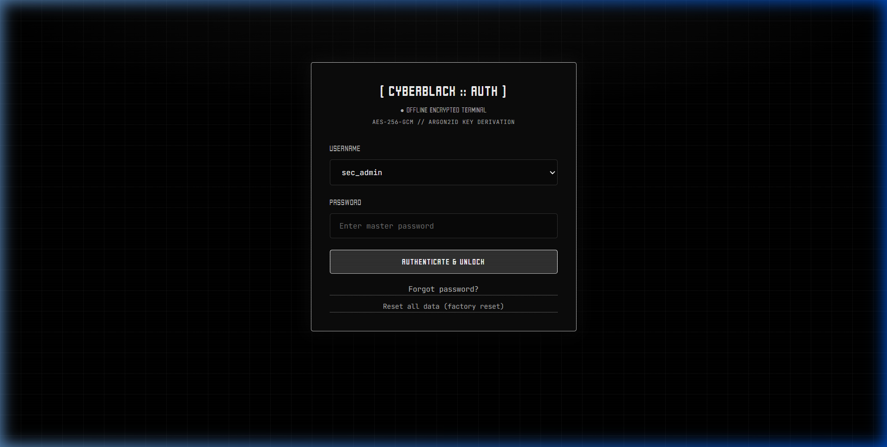

---

### 3. Security Operations Dashboard
Engineered with **Colorlib Shapely** fluid responsive spacing, a mission hero banner, **Coolvetica** stat counters, system telemetry specs, and tactical shortcut action cards.

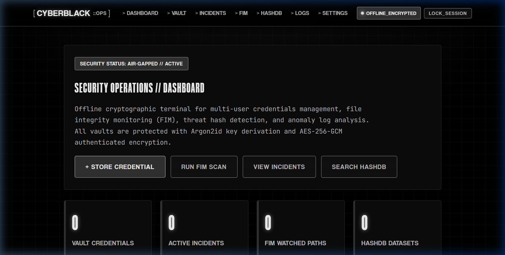

---

### 4. Encrypted Credential Vault
Store passwords, usernames, target URLs, and sensitive notes protected by per-user AES-256-GCM authenticated encryption. Includes instant search filtering, copy-to-clipboard, and integrated password generation.

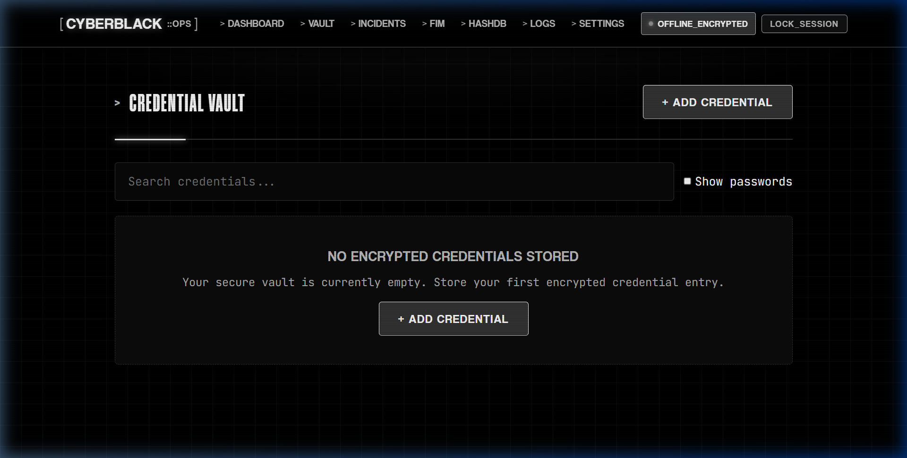

---

### 5. Incident Response Tracker
Triage and manage cybersecurity breaches, unauthorized access attempts, and indicators of compromise (IOCs) with severity levels (`LOW`, `MED`, `HIGH`, `CRITICAL`) and resolution tracking.

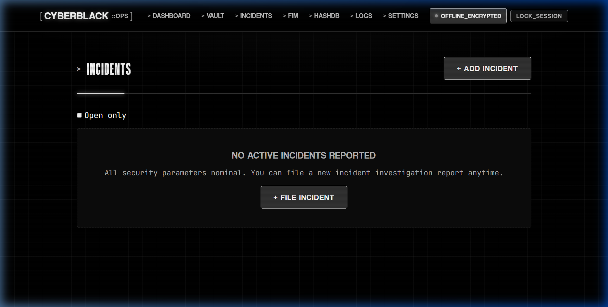

---

### 6. File Integrity Monitoring (FIM)
Establish cryptographic directory baselines using SHA-256 file hashing. Detect and inspect added, modified, or deleted files across sensitive local file trees with clear diff output.

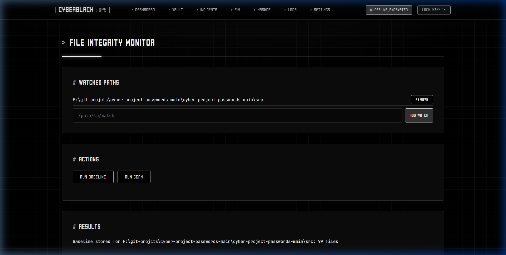

---

### 7. Threat Intelligence Hash Database (HashDB)
High-performance batch-import known malicious SHA-256 hashes from threat feeds, query unknown file hashes offline, and maintain verified local threat datasets.

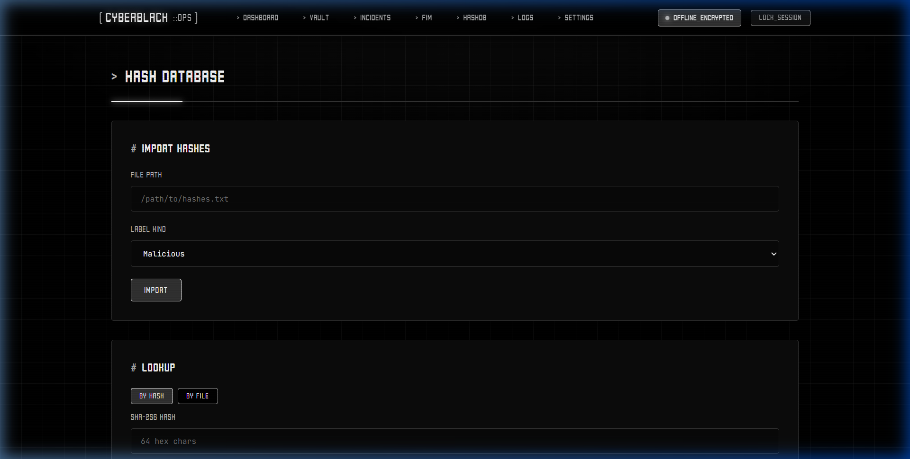

---

### 8. Forensic Log Analyzer
Ingest and parse local system, authentication, and firewall logs. Automatically extracts log levels, frequency patterns, and isolates anomalous error lines with copyable technical details.

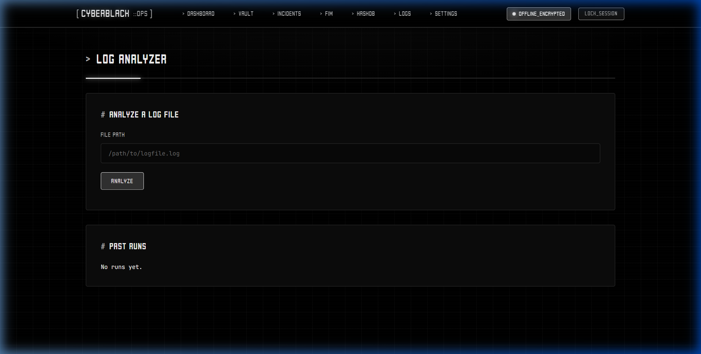

---

### 9. System Parameters & User Administration
Manage horizontal multi-user privileges, add secondary operator accounts, update master credentials, and inspect security parameters.

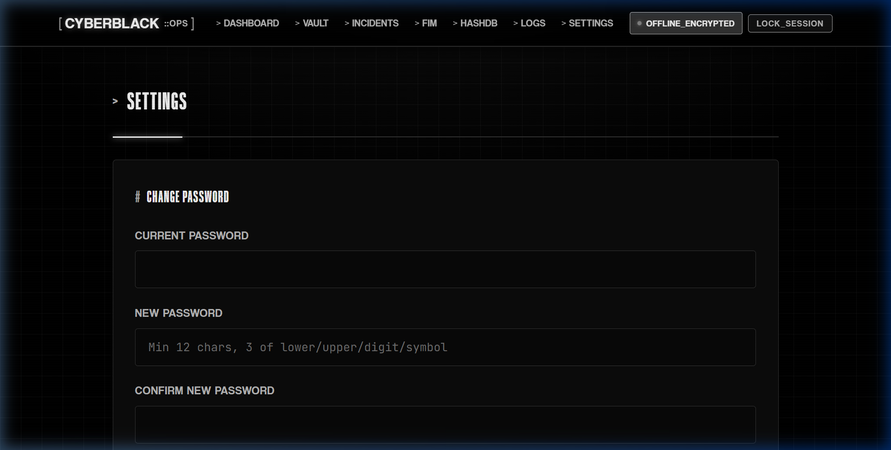

---

### 10. Zero-Knowledge Password Recovery
If master credentials are lost, verify against the separately hashed recovery hint question to reset access without creating backdoors into previous encrypted vault data.

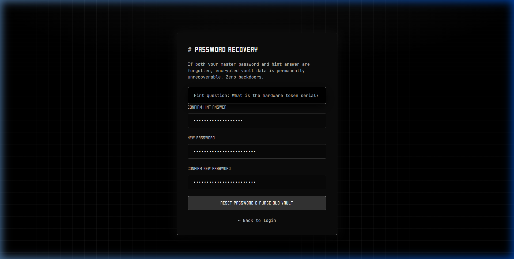

---

### 11. Dedicated 404 System Diagnostic Error Page
Unrecognized route hashes trigger a dedicated system diagnostic page displaying the exact route trace, diagnostic guidance, and direct quick-navigation shortcuts.

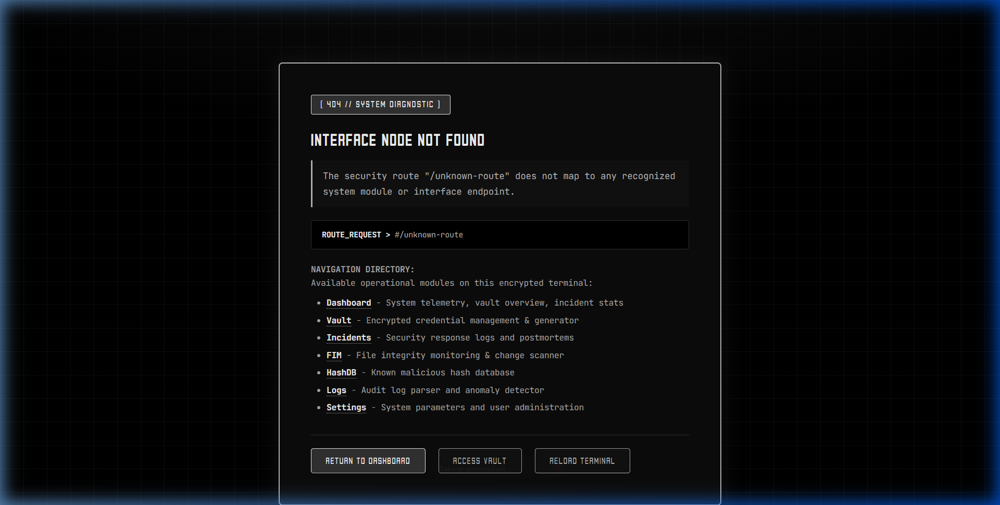

---

## Design System & UI Specifications

The visual interface is built with strict adherence to the requested monochrome cybersecurity design specification:

- **Strict Monochrome Palette**:
  - `#FFFFFF` — Primary headings, active accents, CTA button highlights, error badges
  - `#BEBEBE` — Secondary text, borders, pill indicators, labels
  - `#AFAFAF` — Muted text, hints, breadcrumbs, table headers
  - `#333333` — Card borders, dividers, dark button surfaces, telemetry pills
  - `#000000` — Pitch black viewport canvas, terminal boxes, input fields
- **Typography**:
  - **Coolvetica** (Typodermic Fonts) — Display font for system brand logo, section headings (`h1`–`h3`), button labels, metric numbers, and error badges.
  - **JetBrains Mono** — High-legibility monospace font for code blocks, log lines, threat hashes, and credential inputs.
- **Layout Model**:
  - **Colorlib Shapely Spacing** — 1200px max-width container, 48px–64px vertical rhythm, generous 32px card padding, and clean grid widgets.
- **Comprehensive Error Architecture**:
  - Dedicated full-page 404 Route Diagnostic screen
  - Dedicated 500 Execution Fault recovery screen
  - 401 Session Timeout automatic interceptor with redirect
  - 403 Forbidden setup lockdown state
  - Network disconnect daemon offline alert banner
  - Plain-language error translation for password policies and confirmations
  - Top-right notification center (`showFlash`) with status icons and manual dismiss

---

## Key Modules

- **Encrypted Credential Vault** — Store passwords, URLs, usernames, and secret notes with instant search and client-side password generation.
- **Incident Response Tracker** — Track, prioritize, triage, and resolve security breaches and indicators of compromise (IOCs).
- **File Integrity Monitor (FIM)** — Establish cryptographic directory baselines using SHA-256 and detect added, modified, or deleted files.
- **Local Hash Intelligence Database (HashDB)** — High-performance batch-import SHA-256 malware/clean hash feeds and perform rapid offline threat lookups.
- **Forensic Log Analyzer** — Ingest and analyze syslog, key=value, and leveled log files directly into sealed vault runs.
- **Multi-User Isolation** — Full horizontal privilege separation with request-bound, thread-isolated memory keys (`ContextVar`).

---

## Security Architecture

- **Argon2id Key Derivation** — Salted Argon2id derivation (`m = 64 MiB, t = 3, p = 4`) applied to all master passwords.
- **AES-256-GCM Authenticated Encryption** — All sensitive payloads (`vault.enc`, `profile_pw.enc`, `hint_pub.enc`) are sealed with authenticated data (AAD) binding versioning and KDF parameters to prevent ciphertext tampering.
- **In-Memory Zeroization** — Master keys and decrypted vault caches are held in memory-managed buffers (`SecretBuffer`) that are actively wiped upon session expiration or logout.
- **Zero Master Backdoor** — Zero cloud bypasses or telemetry. Vault contents can only be decrypted with the user's password.
- **Decoy-Resistant Recovery Hints** — Hint answers are separately hashed using dedicated Argon2id parameters. Recovery allows resetting account access without creating backdoor access to previous vault data.
- **Timing Leak Defenses** — Unauthenticated and non-existent username login attempts execute constant-time dummy Argon2id derivations to neutralize user enumeration attacks.
- **Atomic File Operations & Strict Permissions** — Atomic write-and-rename routines (`atomic_write`) paired with owner-only access controls (`0600` on POSIX systems).
- **Progressive Account Lockout** — Protects against brute-force attacks by enforcing progressive backoffs after repeated failed attempts.

---

## Storage Architecture

Resolved via `platformdirs`. Override location at any time with `CSP_DATA_DIR=/custom/path`.

- **Windows**: `%LOCALAPPDATA%\csp\cyber-project-passwords\`
- **Linux**: `$XDG_DATA_HOME/csp/cyber-project-passwords/`
- **macOS**: `~/Library/Application Support/csp/cyber-project-passwords/`

### On-Disk Hierarchy

```
master.json             # Global user list and initialization state (no secrets)
lockout.json            # Failed authentication counters and timestamps (no secrets)
users/<username>/
  profile_pw.enc        # Sealed master password authentication profile
  hint_pub.enc          # Sealed recovery question and answer hash
  vault.enc             # Sealed per-user AES-256-GCM encrypted database
hashdb/
  sources.json          # Hash feed import metadata
```

---

## CLI Reference

```bash
# Display version information
python -m csp --version

# View system and storage directory status
python -m csp status

# Start web interface
python -m csp serve --port 8899

# Perform a verified local data wipe
python -m csp reset --confirm-wipe
```

---

dm to this e-mail unknownwalamauy@gmail.com for any queries
